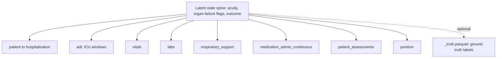

# CLIFForge — Synthetic CLIF 2.1 Dataset Generator - Plan

## Goal Capsule

- **Objective:** Ship `clif-forge` (product name **CLIFForge**), a new standalone repo that generates fully synthetic ICU datasets in exact CLIF 2.1 format. Its public identity is a synthetic generator: openly redistributable, carrying no patient-level provenance, clinically coherent enough that code written against it behaves as against real CLIF. It learns *how a realistic CLIF table is shaped* from aggregate, non-derivable statistics fitted once over real CLIF-MIMIC — that provenance is an internal technical/citation detail, not the headline.
- **Positioning:** An expansion of the consortium's own `synthetic_clif` (MIT, generates all 28 CLIF 2.1.0 tables from hand-specified priors). CLIFForge's differentiator is **empirical fidelity**: it fits its distributions, couplings, and trajectories to real ICU data instead of hand-priors, so its output matches real CLIF closely enough to train models against (TSTR AUC gap is the headline fidelity number). `synthetic_clif` is treated as upstream prior art — a schema-conformance cross-check and an optional baseline for prior-driven tables — not a competitor and not a hard runtime dependency.
- **Product authority:** J.C. Rojas. Runtime target is Mac Studio, 64 GB unified memory, CPU/MPS only (no GPU ever required).
- **Open blockers (must resolve before or during Tier 0/1):**
  - **Full real CLIF-MIMIC to be staged by owner.** Owner will provide the complete 14-table MIMIC-IV-Ext-CLIF v1.1.0 set. A partial real set is present in Dropbox at `~/Library/CloudStorage/Dropbox/Historic Dropbox/Historic FIles/Shared Downloads/` (9 tables: `clif_labs`, `clif_medication_admin_continuous`, `clif_medication_admin_intermittent`, `clif_adt`, `clif_hospital_diagnosis`, `clif_hospitalization`, `clif_crrt_therapy`, `clif_code_status`, `clif_ecmo_mcs`); missing there: `patient`, `vitals`, `respiratory_support`, `position`, `patient_assessments`, `microbiology_culture`. Until fully staged, the 40 MB / 9-table privacy-preserved sample (`~/Projects/MIMIC-CLIF/data/privacy_preserved_sample/`) stands in as a pipeline-development fixture only (its perturbation makes it unfit for final parameter fitting). These are absolute local paths used only by the one-time fit stage; no data path is committed to the repo.
  - **Reference data is CLIF 2.0.0 and outlier CSVs are absent.** The vendored category CSVs in `MIMIC-CLIF/data/reference/` are keyed to 2.0.0, and no outlier-threshold CSVs exist anywhere — yet `in_range` bounds are a hard conformance gate. The authoritative 2.1.0 mCIDE CSVs live in the spec repo at `github.com/Common-Longitudinal-ICU-data-Format/CLIF/tree/main/mCIDE/` (per-table subfolders; note the `position` folder is misspelled `postion/` upstream). Outlier thresholds must be sourced from the consortium or derived from the 2.1.0 dictionary ranges.
  - **clifpy CLIF-version parity.** clifpy (Apache-2.0, latest v0.5.0) validates primarily against **CLIF 2.0**, with partial 2.1 Beta support. pandera is the primary gate; clifpy is the secondary gate, per-table, only where 2.1.0 coverage is confirmed on `main`.
  - **PhysioNet/MIMIC redistribution posture.** MIMIC-IV-Ext-CLIF v1.1.0 sits under a PhysioNet credentialed DUA. The aggregate-only architecture (n ≥ 20 cell gate, no row-level emission) is designed to make the output genuinely non-derivative and therefore redistributable — but confirm with the PhysioNet/MIMIC team and Rush research compliance **before** public release, and honor the citation obligation to CLIF-MIMIC in the technical/methods documentation. Not legal advice.

---

## Product Contract

### Summary

A fully synthetic CLIF 2.1 ICU dataset generator built for the uses real CLIF-MIMIC cannot serve — public ETL smoke-testing, CI fixtures, agent development, teaching, and demos. It expands on `synthetic_clif` by fitting aggregate-only parameters over real CLIF-MIMIC once, then sampling offline from a versioned parameter pack, with a latent state spine keeping every table clinically coherent. It ships one table at a time behind a two-gate conformance harness (pandera primary → clifpy secondary), with Tiers 1–3 forming a shippable v0.1 and all six tiers planned here.

### Problem Frame

The consortium needs an ICU dataset in exact CLIF 2.1 format that is openly redistributable and clinically coherent, for contexts where real CLIF-MIMIC's credentialed DUA blocks use. The consortium's `synthetic_clif` covers all 28 tables and is schema-valid, but generates from hand-specified priors, so it cannot match real empirical distributions or preserve the cross-table clinical couplings that make synthetic data trainable-against. The retired v1 approach (SynthEHRella, row-level synthesis, CLIF 2.0.0) creates a memorization liability that must then be disproven, does not respect CLIF's entity model at ICU temporal resolution, and — for the libraries surveyed — is blocked on license or missing-data handling. The core reframing: make non-derivation from any individual record a property of the architecture rather than a claim defended after the fact, and make empirical realism the differentiator over prior-driven synthetic data.

### Key Decisions

- **Aggregate-only fit-then-sample.** A one-time fit stage runs Polars over real CLIF-MIMIC and emits a versioned parameter pack (marginals, semi-Markov transition/sojourn distributions, per-state AR(1) physiology parameters, lab copula correlations, infusion hazards). No row-level record leaves the fit stage; every fitted parameter is gated on a minimum cell count (n ≥ 20). The generate stage samples entirely from the parameter pack, offline, with no real data present. This is what makes the output safely open-sourceable and the "synthetic" claim true rather than marketing.
- **Latent state spine as sole source of truth.** Each synthetic hospitalization first gets an internal trajectory of acuity, organ-failure flags, and outcome. Every table reads from this spine, never from its siblings — this is what pairs vasopressors with hypotension, sedation with IMV, prone with severe hypoxemia. The spine is not a CLIF table; it is optionally retained as `_truth.parquet` for benchmarking (free ground-truth labels).
- **Hand-rolled semi-Markov engine.** pomegranate (v1.x, PyTorch rewrite) has no native semi-Markov support — a plain Markov chain gives only geometric dwell times, which ICU state durations are not. The trajectory engine is a hand-rolled sampler: an embedded transition matrix (zero diagonal) plus a per-state sojourn distribution (lognormal / gamma / negative-binomial), fully seedable with numpy `Generator(PCG64)`. This is ~a few dozen lines and removes a heavy dependency; pomegranate is not used.
- **Hand-rolled Gaussian copula for correlated labs.** The DataCebo `copulas` library is **BUSL-1.1** (the same non-permissive class the project excludes SDV for) — it is excluded. Lab correlation structure is captured by a hand-rolled Gaussian copula (numpy/scipy: rank-transform → inverse-normal → correlation matrix → sample MVN → normal-CDF → per-column inverse marginal), which is permissive-clean, Polars-native, and seedable. `statsmodels` `GaussianCopula` (BSD-3) is the fallback if the hand-rolled path proves insufficient.
- **Parametric / CPU over GPU deep generators.** CPU/MPS-only hardware makes the parametric path faster to correct and identical to run at any site.
- **Licensing constraints drive the stack; all deps must be permissive (MIT / BSD / Apache-2.0) for production redistribution.** Polars, pandera (MIT), clifpy (Apache-2.0), SDMetrics (MIT — the DataCebo library deliberately kept permissive), synthcity metrics-only (Apache-2.0), numpy (BSD), scipy (BSD), Faker (MIT), LightGBM (MIT). **Excluded:** SDV and `copulas` (Business Source License), synthcity *generators* (no missing-data handling; imputing then re-sparsifying would manufacture the exact artifacts CLIF flags — metrics module retained), pomegranate (unnecessary given the hand-rolled engine), and any GPU deep generator.
- **Two-gate conformance (not three).** There is no consortium tool named `clif-guard` — it does not exist and is removed from the plan. The conformance harness is: pandera schemas generated from the 2.1.0 mCIDE + outlier CSVs (**primary** gate, enforces bounds and membership) → clifpy validators (**secondary** gate, per-table where 2.1.0 parity is confirmed). CLIF Lighthouse may be run as an optional manual cross-check.
- **pandera validates eager DataFrames, never bare LazyFrames.** `pandera.polars` runs value-level checks (`isin`, `in_range`) only on a materialized `pl.DataFrame`; on a `LazyFrame` it silently runs schema-level checks only. Every conformance call `.collect()`s (or receives an eager frame) before validating, so mCIDE membership and outlier bounds actually fire.
- **CLIF 2.1.0 is the conformance target; 2.1.1 noted.** The spec has 28 tables (16 Beta + 12 Concept). A 2.1.1 patch (Jan 2026) exists; target 2.1.0 and record the exact mCIDE snapshot commit in provenance so 2.1.1 can be diffed later. `code_status` was promoted to Beta in 2.1.0 and now has a MIMIC source path (it is fitted, not prior-driven). There is no `therapy_session` table — only `therapy_details` (Concept).
- **New standalone repo, expanding synthetic_clif.** `clif-forge` is a brand-new repo (Python package `clifforge`) with a fresh Polars/uv/pandera stack. `~/Projects/MIMIC-CLIF` serves only as the fit-stage data + reference source; it is not renamed or reused as the codebase. `synthetic_clif` is upstream prior art, not a fork or dependency.
- **Provenance is never fabricated.** Fitted (data-driven) and prior-driven tables are distinguishable in a per-table manifest; the manifest is technical documentation, not a public marketing surface.

### Requirements

**Privacy and provenance**

- R1. No row-level real record leaves the fit stage; only aggregate parameters are emitted.
- R2. Every fitted parameter is gated on a minimum cell count of n ≥ 20; cells below the threshold are not emitted (they fall back to a prior or a coarser aggregate). Continuous marginals are emitted only as parametric families or as coarse quantile bins each backed by n ≥ 20 real observations — never as raw empirical CDFs/quantile vectors that would carry individual real values into the pack (see KTD-4).
- R3. The generate stage runs offline with no real data present, sampling only from the parameter pack.
- R4. A per-table `PROVENANCE.md` manifest distinguishes fitted (data-driven) tables from prior-driven ones, records mCIDE/outlier source URLs + the exact spec-repo commit + retrieval date for offline reproducibility, and carries the CLIF-MIMIC citation for the methods documentation.
- R4a. Public-facing documentation (README, demo report) describes CLIFForge as a synthetic generator; the MIMIC-derived learned-parameter provenance is disclosed at the technical/citation level (PROVENANCE, methods), honoring the PhysioNet DUA, not headlined as "this is MIMIC data."

**CLIF conformance and data integrity**

- R5. Every `*_category` value is an exact, case-sensitive match to the 2.1.0 mCIDE CSVs, validated at generation time on an eager DataFrame; generation fails loudly on any mismatch.
- R6. `*_name` fields carry realistic Epic-style source strings mapped to their category.
- R7. All datetimes are tz-aware UTC in `YYYY-MM-DD HH:MM:SS+00:00` form (pandera `DateTime(time_zone="UTC")`).
- R8. Referential integrity holds across all tables (`patient_id` → `hospitalization_id`) with zero orphans.
- R9. All numerics fall inside the consortium outlier thresholds (plausibility), enforced by pandera `in_range`.

**Table-specific clinical semantics**

- R10. `respiratory_support` honors the expected `*_set` matrix per device × mode (IMV/AC → fio2_set, tidal_volume_set, resp_rate_set; NIPPV → fio2_set, peep_set, and pressure_support_set or peak_inspiratory_pressure_set; CPAP → fio2_set, peep_set; High Flow NC → fio2_set, lpm_set); `tracheostomy` is INT 0/1 and persists once set to 1; Trach Collar implies off IMV; intubation/extubation transitions are valid only when `tracheostomy = 0`.
- R11. `medication_admin_continuous` uses a rate for `med_dose_unit`; an infusion stop is encoded as a new row with `med_dose = 0` and appropriate `mar_action` (+ `mar_action_group` new in 2.1.0); boluses go to intermittent only. There is no explicit end-time column — stop is the zero-dose row.
- R12. `hospitalization.discharge_category` is drawn from the exact permissible list; `death_dttm` is set iff the patient Expired and is consistent with `discharge_dttm`.

**Scope and parity**

- R13. The generator targets the 14-table MIMIC-IV-Ext-CLIF v1.1.0 set for empirical (fitted) parity: patient, hospitalization, adt, vitals, labs, respiratory_support, medication_admin_continuous, medication_admin_intermittent, patient_assessments, position, microbiology_culture, crrt_therapy, code_status, and (hospital_diagnosis / patient_procedures — confirm final two against the PhysioNet file listing).
- R14. CLIF 2.1.0 tables with no MIMIC source (`ecmo_mcs`, `key_icu_orders`, `therapy_details`, `invasive_hemodynamics`, `transfusion`, `provider` — all Concept-tier) are prior-driven from consortium clinical rules and literature rates, and labeled as such in the manifest. (`code_status` is **not** in this set — it is Beta with a MIMIC path and is fitted.)
- R15. Each table's definition of done follows a fixed unit shape: pandera schema from the 2.1.0 dictionary → generator → validator (mCIDE exact-match, bounds, referential integrity) → pytest fixture → merged and frozen. One PR per unit, no forward dependencies — with a single explicit exception: **Tier 4 (U12–U15) ships as one combined PR** because its four generators are cross-coupled through the spine and validated together (KTD-7); they are still four units in the plan, merged in one PR.

**Conformance gates and evaluation**

- R16. pandera schemas enforce (not merely document) bounds and mCIDE membership on eager DataFrames, and are the primary CI gate.
- R17. clifpy validators run as the secondary gate, per-table where 2.1.0 parity is confirmed on `main`; until then pandera alone gates that table and the gap is recorded.
- R18. `synthetic_clif`'s schema output is used as an independent conformance cross-check in CI (generate a small corpus, confirm the two tools agree on column names/dtypes per table).
- R19. A utility (TSTR) evaluation trains the LightGBM mortality model on synthetic data and tests on real Rush-CLIF (or held-out real CLIF-MIMIC); the AUC gap is the reported headline fidelity number. **The held-out real test set must be patient-disjoint from the fit data**: when the test set is a CLIF-MIMIC split (not an external Rush set), the fit stage reserves that split *before* fitting and never fits on it — otherwise the synthetic data derives from parameters fitted on the test patients and the AUC gap is optimistically biased. The split is a fixed patient-ID partition recorded in the pack manifest (see U5).
- R20. A privacy evaluation reports synthcity metrics (DCR, NN-distance ratio, identifiability) precisely, using the metrics module standalone (no generator plugins, isolated dependency).

**Engineering and reproducibility**

- R21. Python 3.11+, Polars only (no pandas in the generate path; `.to_pandas()` bridges are allowed only at the SDMetrics/synthcity metric boundary), `uv`, `pyproject.toml`, `ruff` + `mypy` clean, pinned dependencies.
- R22. A single `--seed` reproduces byte-identical output (one `numpy.random.Generator(PCG64(seed))` threaded through the whole pipeline; `SeedSequence.spawn` for independent per-table streams; `Faker.seed`).
- R23. The CLI generates a dataset by patient count, seed, and output path: `uv run clif-forge generate --n-patients 1000 --seed 42 --out ./output/`.
- R24. mCIDE and outlier CSVs are vendored into the repo at build time for offline reproducibility, with the source commit recorded.
- R25. Generation exits nonzero on any validation failure.

**Deliverables**

- R26. The `clif-forge` repo as specified.
- R27. A committed demo dataset at n=100 under `demo_output/`.
- R28. A Markdown validation + fidelity + privacy report generated from the demo run.

### Key Flows

- F1. **Fit (one-time, requires real data).**
  - **Trigger:** Operator runs the fit stage against staged real CLIF-MIMIC.
  - **Steps:** Polars reads the real parquet → derive marginals, semi-Markov transition/sojourn distributions, per-state AR(1) physiology parameters, lab copula correlations, infusion hazards → drop any cell with n < 20 (fall back to prior/coarser aggregate) → emit a versioned parameter pack + provenance manifest. No row-level record is written out.
  - **Outcome:** A versioned parameter pack; real data is no longer needed downstream.
  - **Covered by:** R1, R2, R4
- F2. **Generate (offline, no real data).**
  - **Trigger:** User runs the CLI with a patient count and seed.
  - **Steps:** For each synthetic hospitalization, sample a latent state spine (acuity, organ-failure flags, outcome) → generate each CLIF table by reading only from the spine and the parameter pack, in build-order tiers → validate every table on an eager DataFrame (mCIDE exact-match, bounds, referential integrity) → write output (and optionally `_truth.parquet`).
  - **Outcome:** A CLIF 2.1 dataset that passes both gates, or a nonzero exit on any validation failure.
  - **Covered by:** R3, R5–R12, R22, R23, R25

### Build order

Each tier is a self-contained unit (R15). Tiers 1–3 alone are a shippable **v0.1** — enough for ETL smoke-tests and CI fixtures months before Tier 6. All six tiers are fully planned in Implementation Units below.

| Tier | Tables | Notes |
|---|---|---|
| 0 | state spine | internal, not shipped |
| 1 | patient → hospitalization | roots |
| 2 | adt | defines ICU windows for everything downstream |
| 3 | vitals, labs | independent given the spine |
| 4 | respiratory_support, medication_admin_continuous, patient_assessments, position | ship as one unit — cross-coupled (prone↔hypoxemia, sedation↔IMV, RASS↔sedation depth) |
| 5 | medication_admin_intermittent, microbiology_culture, crrt_therapy, code_status | sparse event tables (all fitted) |
| 6 | gap-fill Concept tables (R14) | prior-driven, manifest-flagged |

### Visualization — state-spine fan-out

Every CLIF table derives from the latent state spine, never from a sibling table. This single-source-of-truth structure is what preserves clinical coherence.



### Acceptance Examples

- AE1. **respiratory_support device/mode matrix.**
  - **Covers:** R10
  - **Given** a hospitalization on IMV with `tracheostomy = 0`
  - **When** a Trach Collar device is applied
  - **Then** IMV is off, and the `*_set` fields match the expected matrix for the new device × mode.
- AE2. **Tracheostomy persistence blocks intubation transition.**
  - **Covers:** R10
  - **Given** `tracheostomy = 1` earlier in the trajectory
  - **When** the generator considers an intubation/extubation transition
  - **Then** that transition is not emitted (valid only when `tracheostomy = 0`), and `tracheostomy` remains 1 for the rest of the encounter.
- AE3. **Continuous-infusion stop encoding.**
  - **Covers:** R11
  - **Given** an active continuous norepinephrine infusion
  - **When** the infusion stops
  - **Then** a new row is emitted with `med_dose = 0` and an appropriate `mar_action` — not a deleted or mutated prior row — and no bolus appears in the continuous table.
- AE4. **Death/discharge consistency.**
  - **Covers:** R12
  - **Given** a hospitalization whose spine outcome is Expired
  - **When** the hospitalization row is generated
  - **Then** `death_dttm` is set, `discharge_category` is the Expired permissible value, and `death_dttm` is consistent with `discharge_dttm`; conversely, a survivor never has `death_dttm` set.
- AE5. **mCIDE exact-match fail-loud.**
  - **Covers:** R5, R25
  - **Given** a generated `*_category` value that is not a case-sensitive member of the mCIDE CSV
  - **When** generation-time validation runs on the eager DataFrame
  - **Then** generation fails loudly and exits nonzero.
- AE6. **Seed reproducibility.**
  - **Covers:** R22
  - **Given** two runs with `--seed 42 --n-patients 100`
  - **When** both complete
  - **Then** every output parquet is byte-identical between the two runs.

### Scope Boundaries

**Milestone, not deferral**

- All six tiers are planned here. v0.1 = Tiers 1–3 is the first shippable milestone (ETL smoke-tests, CI fixtures); Tiers 4–6 follow in order without a separate planning pass.

**Outside this product's identity**

- Row-level generative synthesis (the retired v1 approach) — reintroducing it would restore the memorization liability the architecture exists to avoid.
- GPU / deep generative models — CPU/MPS-only is a hard runtime constraint.
- SDV, `copulas`, and synthcity generator plugins — excluded on license (SDV, copulas: BUSL) and missing-data handling (synthcity generators); only synthcity's metrics module and SDMetrics are used.
- Any dependency that is not permissive (MIT / BSD / Apache-2.0) for production redistribution.
- A hard runtime dependency on `synthetic_clif` — it is upstream prior art and a conformance cross-check, not a coupling.

### Success Criteria

- Both gates (pandera primary → clifpy secondary) pass green in CI on the synthetic corpus, and the `synthetic_clif` cross-check agrees on schema.
- TSTR AUC gap (synthetic-train / real-test LightGBM mortality, tested on the patient-disjoint held-out real split) is the headline fidelity number, with a concrete acceptance bar: **target gap ≤ 0.05 AUC, ceiling ≤ 0.10**. A gap ≤ 0.05 clears the "trainable-against" claim; 0.05–0.10 ships with a documented caveat; **> 0.10 is a falsification signal** — the empirical-fidelity premise (the whole differentiator over prior-driven `synthetic_clif`) has failed, and the response is to investigate the spine/coupling model before publishing a fidelity claim, not to relax the bar. The exact threshold is provisional and confirmed against the first full-data fit.
- Privacy metrics (DCR, NN-distance ratio, identifiability) are reported precisely and are clean, as the aggregate-only architecture predicts.
- A single `--seed` reproduces byte-identical output.
- Tiers 1–3 (v0.1) generate a dataset usable for ETL smoke-tests and CI fixtures.

### Naming

`clif-forge` (repo + CLI) · `clifforge` (Python package) · CLIFForge (product name) · `_truth.parquet` (retained spine). (`clif-guard` is removed — it does not exist.)

---

## Planning Contract

### Key Technical Decisions

- KTD-1. **Two-stage package split: `clifforge.fit` (real data, one-time) vs `clifforge.generate` (offline).** The fit package is the only code that ever imports a real-data path; the generate package imports only the parameter pack. This boundary is enforced structurally (no `generate` module imports `fit`) so the "no real data at generation time" guarantee is a property of the import graph, not a convention. Rationale: R1/R3 must be architecturally true.
- KTD-2. **Parameter pack is a versioned, self-describing directory of JSON + small parquet.** Not a pickle (not portable, not inspectable, security-smell). Schema: `pack_version`, `clif_version`, `fit_source` (dataset id + commit, no PHI), per-table parameter blocks, and the n≥20 audit (how many cells were suppressed and to what fallback). The generate stage validates `pack_version` compatibility on load. Rationale: R2, R4, reproducibility, inspectability.
- KTD-3. **Hand-rolled semi-Markov engine (`clifforge.generate.semimarkov`).** Embedded transition matrix (zero diagonal) + per-state sojourn distribution family chosen per state at fit time (lognormal/gamma/negative-binomial by AIC). Absorbing states = discharge/death. Deterministic under a passed-in `Generator`. Rationale: pomegranate can't do non-geometric dwell times; this is small and dependency-free.
- KTD-4. **Hand-rolled Gaussian copula (`clifforge.generate.copula`).** Fit: per-column **parametric** marginal (fitted distribution family + params) or a coarse quantile-binned marginal where **every bin is backed by n ≥ 20 real observations** — never a raw empirical CDF/quantile vector, which would be a stored copy of real column values (including re-identifying tail/outlier values) that the inverse-marginal step would re-emit into the redistributable pack. Correlation structure is a Spearman-derived matrix (nearest-PD-corrected). Sample: MVN → Φ → inverse-marginal. Rationale: `copulas` is BUSL; statsmodels `GaussianCopula` (BSD) is the drop-in fallback if the correlation reconstruction is inadequate. This constraint is what makes R1's "no row-level real record leaves the fit stage" true of the copula path specifically, not just the categorical marginals.
- KTD-5. **pandera schemas are code, generated once from the vendored 2.1.0 mCIDE + outlier CSVs by a build script, then committed.** Not regenerated at runtime. One schema module per table under `src/clifforge/schemas/`. All validation targets eager `pl.DataFrame`. Rationale: KTD (pandera LazyFrame gotcha), R16, offline reproducibility.
- KTD-6. **Latent state spine is the only cross-table channel.** Table generators receive `(spine, param_pack, rng)` and never read another table's output. Enforced by generator signatures. Rationale: clinical coherence (R10–R12 couplings), testability.
- KTD-7. **Tier 4 ships as one PR but is four generator modules coupled through the spine, not through each other.** The coupling (prone↔hypoxemia, sedation↔IMV, RASS↔sedation) is expressed as spine fields read independently by each generator, so they stay decoupled in code while coherent in output. Rationale: avoids a monolith while honoring R15's "no forward dependencies."
- KTD-8. **`synthetic_clif` is vendored only as a test-time reference (dev dependency), and consulted as the prior source for Tier 6 prior-driven tables.** No production import. Rationale: "expansion of synthetic_clif" without coupling to its release cadence (Scope Boundaries).

### High-Level Technical Design

Package layout (repo-relative):

```
clif-forge/
  pyproject.toml
  README.md
  src/clifforge/
    __init__.py
    cli.py                         # Typer/argparse entry: generate, fit
    reference/
      loader.py                    # load vendored mCIDE + outlier CSVs
      data/                        # vendored 2.1.0 mCIDE + outlier CSVs (R24)
    schemas/
      base.py                      # shared column types, tz-aware DateTime, id types
      <table>.py                   # one pandera schema per CLIF table
    fit/
      run_fit.py                   # CLI: fit against real CLIF-MIMIC
      estimators.py                # marginals, transitions, sojourns, AR(1), copula, hazards
      param_pack.py                # write/read/version the parameter pack (KTD-2)
      cell_gate.py                 # n>=20 suppression + fallback (R2)
    generate/
      semimarkov.py                # hand-rolled engine (KTD-3)
      copula.py                    # hand-rolled Gaussian copula (KTD-4)
      spine.py                     # latent state spine sampler (Tier 0)
      orchestrator.py              # tier-ordered table generation + validation
      tables/<table>.py            # one generator per CLIF table
    conformance/
      gate.py                      # pandera (primary) -> clifpy (secondary) harness
      cross_check.py               # synthetic_clif schema agreement (R18)
    eval/
      tstr.py                      # LightGBM train-synth/test-real (R19)
      privacy.py                   # synthcity metrics standalone (R20)
      fidelity.py                  # SDMetrics column/pair metrics
      report.py                    # Markdown report (R28)
    provenance.py                  # PROVENANCE.md manifest writer (R4)
  tests/
    conftest.py                    # seeded rng fixtures, tiny param-pack fixture
    schemas/ | generate/ | fit/ | eval/ | conformance/
  demo_output/                     # committed n=100 dataset (R27)
  docs/plans/                      # this plan
```

Data flow: `fit/run_fit.py` (real data) → parameter pack (KTD-2) → `generate/orchestrator.py` (offline) → per-table generators (spine + pack) → `conformance/gate.py` (eager validate) → parquet + optional `_truth.parquet` → `eval/*` → `report.py`.

### Assumptions

- The owner will stage the full 14-table real CLIF-MIMIC set before the fit stage (U5) runs; until then U1–U4 and generator scaffolding proceed against the privacy-preserved sample as a pipeline fixture (development only, not final fit).
- **New-in-2.1.0 fields may have no real fit source.** Several columns targeted here are new in 2.1.0 (`admission_type_category`, `mar_action_group`, `location_type`, `hospital_type`, `device_id`, `loinc_code`, `organism_group`) and are unlikely to be present in the MIMIC-IV-Ext-CLIF v1.1.0 export, which was produced against an earlier dictionary. U5 performs a **field-level source audit**: for every 2.1.0 column, it records whether the real source actually contains it. A new-in-2.1.0 field with no real source is routed explicitly to **prior-driven** generation and flagged as such in `PROVENANCE.md` at field granularity — it is never labeled "fitted", and its plausibility is asserted only against the mCIDE list, not against a fitted marginal. This keeps the fitted/prior-driven distinction honest below the table level.
- The 2.1.0 mCIDE CSVs in the spec repo are complete and stable at the pinned commit; outlier thresholds are obtainable from the consortium or derivable from dictionary ranges.
- clifpy 2.1.0 per-table coverage is partial; the plan does not block any table on clifpy — pandera is always sufficient to gate.
- Rush-CLIF (or a held-out real CLIF-MIMIC split) is available as the TSTR real test set. When the CLIF-MIMIC split is used, it is the patient-disjoint held-out partition reserved by U5 *before* fitting — the fit stage never sees those patients — so the AUC gap is not inflated by train/test leakage. An external Rush-CLIF test set is inherently disjoint and needs no reservation.

### Sequencing

U1 → U2 → U3 (foundation) → U4 → U5 (fit) → U6 (spine, Tier 0) → U7,U8 (Tier 1) → U9 (Tier 2) → U10,U11 (Tier 3) — **v0.1 ships here** → U12–U15 (Tier 4) → U16–U19 (Tier 5) → U20 (Tier 6) → U21 (CLI wiring can land earlier, finalized here) → U22–U24 (eval) → U25 (demo + report + docs). Each table unit is one PR with no forward dependency (R15).

---

## Implementation Units

### U1. Repo scaffold and tooling

- **Goal:** Standalone `clif-forge` repo builds, lints, and tests clean on Python 3.11+ with `uv`.
- **Files:** `pyproject.toml`, `src/clifforge/__init__.py`, `src/clifforge/cli.py` (stub), `tests/conftest.py`, `.gitignore` (exclude `data/`, all parquet/csv except vendored reference, venv), `.github/workflows/ci.yml` (ruff, mypy, pytest), `README.md` (synthetic-first framing per R4a).
- **Approach:** `uv init` layout, pinned permissive deps (polars, pandera[polars], numpy, scipy, faker, lightgbm, sdmetrics; synthcity isolated in an optional extra to contain its torch tree). `ruff` + `mypy` strict on `src/`.
- **Test scenarios:** `uv run pytest` collects; `uv run ruff check` and `uv run mypy src/` exit 0; `uv run clif-forge --help` prints usage.
- **Verification:** CI green on the scaffold commit.

### U2. Reference-data acquisition and vendoring

- **Goal:** 2.1.0 mCIDE + outlier CSVs vendored offline with recorded provenance (R24, R4).
- **Files:** `src/clifforge/reference/data/**` (vendored CSVs, mirroring spec-repo per-table folders; normalize the upstream `postion/` misspelling to `position/`), `src/clifforge/reference/loader.py`, `tests/test_reference_loader.py`, `scripts/vendor_reference.py` (one-time fetch pinned to a spec-repo commit).
- **Approach:** Fetch mCIDE CSVs from `github.com/Common-Longitudinal-ICU-data-Format/CLIF@<commit>/mCIDE/`; source outlier thresholds from the consortium or derive from dictionary ranges into `outliers/<table>.csv`. `loader.py` exposes `categories(table, field) -> list[str]` and `bounds(table, field) -> (min, max)`. Record source URL + commit + retrieval date.
- **Test scenarios:** loader returns exact case-sensitive category lists for a sample of tables (patient.sex_category, respiratory_support.device_category, labs.lab_category); bounds return numeric tuples; a missing category/field raises, not returns empty.
- **Verification:** committed CSVs match the recorded commit; loader tests pass.

### U3. pandera schema layer + conformance harness

- **Goal:** Per-table pandera schemas enforcing dtype, tz-aware UTC datetimes, mCIDE membership (`isin`), and outlier bounds (`in_range`) on eager DataFrames; the two-gate harness (R5, R7, R8, R9, R16, R17).
- **Files:** `src/clifforge/schemas/base.py`, `src/clifforge/schemas/<table>.py` (generated by `scripts/gen_schemas.py` from U2 data, then committed), `src/clifforge/conformance/gate.py`, `src/clifforge/conformance/cross_check.py`, `tests/schemas/test_<table>.py`, `tests/conformance/test_gate.py`.
- **Approach:** `base.py` defines shared types — `DateTime(time_zone="UTC")` from `pandera.engines.polars_engine`, id string types, category-field factory (`isin=` from loader), bounded-float factory (`in_range=` from loader). `gate.py`: `validate(df: pl.DataFrame, table: str)` runs pandera (primary), then clifpy (secondary) only where a 2.1.0 validator exists, aggregating with `lazy=True` to collect all errors; raises `ConformanceError` (nonzero exit at CLI). Explicitly `.collect()` any LazyFrame before validating (KTD-5). `cross_check.py` runs `synthetic_clif` on a tiny corpus and asserts column-name/dtype agreement per table (R18, dev-only).
- **Test scenarios:** valid frame passes; a bad `*_category` (wrong case) fails on `isin`; an out-of-bounds numeric fails on `in_range` (AE5); a naive-datetime column fails the tz check; a LazyFrame input is collected and still runs value-level checks (guards the gotcha); clifpy secondary is skipped-with-note where no 2.1.0 validator exists.
- **Verification:** all schema tests pass; gate raises nonzero on each violation class.

### U4. Parameter-pack format, cell gate, and provenance manifest

- **Goal:** Versioned, inspectable parameter-pack read/write; n≥20 suppression with fallback; provenance manifest (R2, R4, KTD-2).
- **Files:** `src/clifforge/fit/param_pack.py`, `src/clifforge/fit/cell_gate.py`, `src/clifforge/provenance.py`, `tests/fit/test_param_pack.py`, `tests/fit/test_cell_gate.py`.
- **Approach:** Pack = a directory of `manifest.json` (pack_version, clif_version, fit_source id + commit, suppression audit) + per-table JSON/parquet parameter blocks. `cell_gate.suppress(counts, params, min_n=20)` drops sub-threshold cells and records the fallback used (prior or coarser aggregate). `provenance.py` writes `PROVENANCE.md` marking each table fitted vs prior-driven and carrying mCIDE/outlier source + CLIF-MIMIC citation (R4a). Loader checks `pack_version` compatibility. A `param_pack.scan_for_leakage(pack)` **value-level** scanner runs before any pack is written or published: beyond the key/schema checks, it rejects any numeric array whose length or distinct-value count approaches the fitted record count (verbatim-value / high-cardinality detection), catching real values embedded inside an otherwise-sanctioned block (empirical quantiles, copula tails, per-stratum residuals). This is the mechanized enforcement of R1/R2 — the key-only check is not sufficient.
- **Test scenarios:** round-trip write/read preserves values; a cell with n=19 is suppressed and its fallback recorded; n=20 is kept; an incompatible `pack_version` raises on load; manifest lists no row-level fields (grep-style assertion that no per-record keys leak); a pack block containing a high-cardinality verbatim-value array is rejected by `scan_for_leakage` even though it uses a legal key.
- **Verification:** tests pass; a fabricated pack with a row-level field is rejected by a schema check; a fabricated pack with verbatim real values inside a legal block is rejected by the value-level scanner.

### U5. Fit stage — estimators over real CLIF-MIMIC

- **Goal:** One-time fit producing the parameter pack: marginals, semi-Markov transitions/sojourns, per-state AR(1) physiology, lab copula correlations, infusion hazards (F1, R1, R2).
- **Files:** `src/clifforge/fit/run_fit.py`, `src/clifforge/fit/estimators.py`, `tests/fit/test_estimators.py`.
- **Approach:** Polars-only reads of real parquet. Before any estimator runs, `run_fit.py` reserves a **patient-disjoint held-out split** (fixed fraction, seeded partition over `patient_id`) for TSTR (R19) and fits *only* on the training partition; the held-out patient-ID set and split seed are written to the pack manifest so U22 tests exclusively on patients no parameter ever saw. `estimators.py`: `fit_marginals`, `fit_transitions` (embedded matrix, zero diagonal), `fit_sojourns` (family by AIC per state), `fit_ar1` (per-state φ, σ, mean for each vital — fitted on vitals resampled onto a fixed time grid, grid step recorded in the pack), `fit_lab_copula` (co-measurement-windowed Spearman → nearest-PD correlation + per-lab marginals + per-lab observed-presence rates), `fit_infusion_hazards` (start/stop/rate-change hazards per drug). Every estimator routes through `cell_gate`. A **field-level source audit** records, per 2.1.0 column, whether the real source contains it; absent new-in-2.1.0 fields are marked prior-driven (Assumptions). `run_fit.py --real-dir <path> --out <pack>`; the only module importing a real-data path (KTD-1). No row-level output.
- **Test scenarios:** run against the privacy-preserved sample fixture → produces a loadable pack; transition matrix rows sum to 1 with zero diagonal; sojourn fit selects a family and returns finite params; AR(1) φ ∈ (−1, 1); copula correlation is symmetric PD; a synthetic input with a rare cell (n<20) yields suppression in the pack, not a leaked value.
- **Verification:** `run_fit` on the sample fixture emits a pack that U4 loads; estimator unit tests pass. (Final fit awaits the full real 14-table set — blocker.)

### U6. Tier 0 — latent state spine sampler

- **Goal:** Per-hospitalization internal trajectory (acuity, organ-failure flags, outcome) driving all tables; hand-rolled semi-Markov engine (KTD-3, KTD-6).
- **Files:** `src/clifforge/generate/semimarkov.py`, `src/clifforge/generate/spine.py`, `tests/generate/test_semimarkov.py`, `tests/generate/test_spine.py`.
- **Approach:** `semimarkov.sample(transitions, sojourns, start_dist, absorbing, rng, horizon)` returns a state+duration sequence. `spine.sample_spine(param_pack, rng) -> SpineFrame` emits acuity level over time, organ-failure flags (respiratory/cardiovascular/renal/neuro), and terminal outcome (survive/expire) — all from pack params. Optionally serialized to `_truth.parquet`.
- **Test scenarios:** deterministic under fixed seed (two calls identical); trajectories terminate at an absorbing state within horizon; sojourn durations are non-geometric when a non-geometric family is configured (distribution check); organ-failure flags are internally consistent with acuity (monotonic-ish); spine is reproducible byte-for-byte given a seed.
- **Verification:** engine and spine tests pass; sampled state marginals match the pack within tolerance.

### U7. Tier 1 — patient generator

- **Goal:** `patient` table: demographics with exact mCIDE categories, realistic `*_name` strings, stable `patient_id` (R5, R6, R8).
- **Files:** `src/clifforge/generate/tables/patient.py`, `tests/generate/test_patient.py`.
- **Approach:** Sample race/ethnicity/sex/language categories from pack marginals; Faker (seeded) for any name-like strings; generate `patient_id` deterministically from the rng stream. Validate via `gate.validate(df, "patient")`.
- **Test scenarios:** all `*_category` values are mCIDE members (case-sensitive); category marginals match pack within tolerance; ids are unique; passes the gate; seed-reproducible.
- **Verification:** unit passes gate; schema test green.

### U8. Tier 1 — hospitalization generator

- **Goal:** `hospitalization` linked to `patient`; death/discharge consistency; admission/discharge categories from mCIDE (R8, R12, AE4).
- **Files:** `src/clifforge/generate/tables/hospitalization.py`, `tests/generate/test_hospitalization.py`.
- **Approach:** One-to-many `patient_id` → `hospitalization_id`; admit/discharge dttm from spine horizon (tz-aware UTC); `discharge_category` from mCIDE; if spine outcome = Expired, set `death_dttm` consistent with `discharge_dttm` and use the Expired discharge value; else `death_dttm` null. `admission_type_category` (new in 2.1.0) sampled from pack.
- **Test scenarios:** AE4 both directions (expired → death_dttm set + consistent; survivor → null); zero orphan hospitalizations; datetimes tz-aware UTC; discharge_category ∈ mCIDE; seed-reproducible.
- **Verification:** gate green; AE4 test passes.

### U9. Tier 2 — adt generator

- **Goal:** `adt` location movements defining ICU windows used by all downstream tables (R8); location categories/types from 2.1.0 mCIDE.
- **Files:** `src/clifforge/generate/tables/adt.py`, `tests/generate/test_adt.py`.
- **Approach:** From spine acuity, emit ordered `in_dttm`/`out_dttm` movements (ED → ward → ICU → …) with `location_category`, `location_type` (new), `hospital_type` (new); contiguous, non-overlapping intervals within the hospitalization window; expose an `icu_windows(hospitalization_id)` helper consumed by later tiers (via the spine/orchestrator, not by table cross-reads).
- **Test scenarios:** intervals are contiguous and within hospitalization bounds; no overlaps; ICU windows align with high-acuity spine segments; categories ∈ mCIDE; seed-reproducible.
- **Verification:** gate green; interval-integrity test passes.

### U10. Tier 3 — vitals generator

- **Goal:** `vitals` long table driven by per-state AR(1) physiology from the spine (R9); `vital_category` ∈ mCIDE; values within outlier bounds.
- **Files:** `src/clifforge/generate/tables/vitals.py`, `tests/generate/test_vitals.py`.
- **Approach:** For each vital, AR(1) walk with per-acuity-state mean/φ/σ from the pack, advanced on the **same fixed time grid the pack was fitted on** (grid step recorded by U5 — the φ/σ parameters are only valid at that sampling interval), then thinned/jittered to a realistic irregular observation cadence within ICU windows for the emitted rows; clamp to outlier bounds; hypotension co-occurs with high cardiovascular-failure spine flag (coupling via spine, KTD-6). Fitting and generating on a common grid is what keeps the AR(1) autocorrelation faithful — fitting on irregular real timestamps and generating on a different cadence would distort φ.
- **Test scenarios:** all values within `in_range`; sbp distribution shifts down when spine cardiovascular-failure flag is set (coupling check); cadence higher inside ICU windows; `vital_category` ∈ mCIDE; seed-reproducible.
- **Verification:** gate green; coupling and bounds tests pass.

### U11. Tier 3 — labs generator

- **Goal:** `labs` long table with correlated panels via the hand-rolled Gaussian copula (KTD-4, R9); `lab_category`/`lab_order_category` ∈ mCIDE; realistic missingness.
- **Files:** `src/clifforge/generate/tables/labs.py`, `tests/generate/test_labs.py`.
- **Approach:** Sample the **full** correlated lab vector from the copula per panel (the correlation was fit over a co-measurement window in U5, pairing labs actually drawn together), then apply a **per-lab observed-presence mask** sampled from the pack's per-lab presence rates: labs whose mask is absent are emitted as native nulls (dropped rows, not imputed) — sample-then-mask, never impute-then-sparsify, so no CLIF missingness artifact is manufactured. Order times within ICU windows; creatinine elevated when spine renal-failure flag set.
- **Test scenarios:** pairwise correlations of generated labs (over co-measured pairs) match the pack copula within tolerance; values within bounds; per-lab null rates match the pack presence rates; no lab value exists for a masked-absent measurement; creatinine shifts with renal-failure flag; categories ∈ mCIDE; seed-reproducible.
- **Verification:** gate green; correlation-similarity and coupling tests pass. **v0.1 ships after U11.**

### U12. Tier 4 — respiratory_support generator

- **Goal:** device × mode `*_set` matrix, tracheostomy persistence, IMV/trach transitions (R10, AE1, AE2). Coupled to spine respiratory-failure flag (KTD-7).
- **Files:** `src/clifforge/generate/tables/respiratory_support.py`, `tests/generate/test_respiratory_support.py`.
- **Approach:** Device/mode sequence from spine respiratory trajectory; per-device expected `*_set` fields populated (matrix in R10), others null; `tracheostomy` INT 0/1, latches to 1; intubation/extubation transitions gated on `tracheostomy = 0`; Trach Collar turns IMV off; `device_id` (new) synthesized.
- **Test scenarios:** AE1 (Trach Collar → IMV off, matrix set-fields correct); AE2 (trach latches, blocks intubation transition); each device populates exactly its expected `*_set` fields and nulls the rest; device/mode ∈ mCIDE; severe-hypoxemia spine flag raises IMV probability; seed-reproducible.
- **Verification:** gate green; AE1 + AE2 tests pass.

### U13. Tier 4 — medication_admin_continuous generator

- **Goal:** rate-encoded infusions, zero-dose stop rows, no boluses (R11, AE3). Vasopressors couple to spine cardiovascular-failure flag.
- **Files:** `src/clifforge/generate/tables/medication_admin_continuous.py`, `tests/generate/test_medication_admin_continuous.py`.
- **Approach:** Infusion start/stop/rate-change from pack hazards; `med_dose_unit` is a rate; a stop is a new row with `med_dose = 0` + appropriate `mar_action`/`mar_action_group` (new); no end-time column. Vasopressor presence tracks cardiovascular-failure spine flag (couples to U10 hypotension via the spine).
- **Test scenarios:** AE3 (stop = new zero-dose row, prior rows unmutated, no bolus); `med_category`/`med_route` ∈ mCIDE; norepinephrine co-occurs with hypotensive vitals through the shared spine flag; doses non-negative and within bounds; seed-reproducible.
- **Verification:** gate green; AE3 test passes.

### U14. Tier 4 — patient_assessments generator

- **Goal:** GCS/RASS and other assessments coupled to sedation depth and neuro spine flag (KTD-7).
- **Files:** `src/clifforge/generate/tables/patient_assessments.py`, `tests/generate/test_patient_assessments.py`.
- **Approach:** RASS tracks continuous-sedation presence (via spine, not by reading U13); GCS tracks neuro-failure flag; `assessment_category` ∈ mCIDE; numeric scores within valid ranges; sampled within ICU windows.
- **Test scenarios:** RASS shifts negative when the spine sedation flag is set; GCS lower with neuro-failure flag; scores within valid ranges; categories ∈ mCIDE; seed-reproducible.
- **Verification:** gate green; coupling tests pass.

### U15. Tier 4 — position generator

- **Goal:** `position` events with prone coupled to severe-hypoxemia spine flag (KTD-7); one position per row.
- **Files:** `src/clifforge/generate/tables/position.py`, `tests/generate/test_position.py`.
- **Approach:** Position changes from spine; prone episodes concentrated in severe-hypoxemia windows and consistent with IMV periods (both read from spine); `position_category` ∈ mCIDE (note upstream `postion/` folder normalized in U2).
- **Test scenarios:** prone rate elevated during severe-hypoxemia spine windows; one position per row; category ∈ mCIDE; seed-reproducible. Tier 4 ships as one PR (R15, KTD-7) — U12–U15 validated together.
- **Verification:** gate green; prone-coupling test passes; Tier-4 integration test confirms cross-table coherence via the spine.

### U16. Tier 5 — medication_admin_intermittent generator

- **Goal:** discrete dose events (boluses, scheduled meds), disjoint from continuous (R11).
- **Files:** `src/clifforge/generate/tables/medication_admin_intermittent.py`, `tests/generate/test_medication_admin_intermittent.py`.
- **Approach:** Discrete `admin_dttm` doses from pack rates; `med_category`/`med_route`/`mar_action` ∈ mCIDE; no continuous infusions here.
- **Test scenarios:** all rows are discrete administrations; no drug that belongs to continuous appears as an infusion here; categories ∈ mCIDE; seed-reproducible.
- **Verification:** gate green; disjointness test passes.

### U17. Tier 5 — microbiology_culture generator

- **Goal:** sparse culture events with organism/fluid/method categories (R5); optional susceptibility linkage.
- **Files:** `src/clifforge/generate/tables/microbiology_culture.py`, `tests/generate/test_microbiology_culture.py`.
- **Approach:** Sparse cultures from pack rates; `fluid_category`/`method_category`/`organism_category`/`organism_group` ∈ mCIDE; `result_dttm` after collection; `loinc_code` (new) where applicable. (microbiology_susceptibility deferred unless present in the real 14-table set.)
- **Test scenarios:** result after collection time; categories ∈ mCIDE; sparsity matches pack; seed-reproducible.
- **Verification:** gate green.

### U18. Tier 5 — crrt_therapy generator

- **Goal:** wide CRRT device-parameter rows coupled to renal-failure spine flag.
- **Files:** `src/clifforge/generate/tables/crrt_therapy.py`, `tests/generate/test_crrt_therapy.py`.
- **Approach:** CRRT sessions during renal-failure spine windows; `crrt_mode_category` ∈ mCIDE; blood/dialysate/replacement-fluid rates and ultrafiltration within bounds.
- **Test scenarios:** CRRT present only (or predominantly) during renal-failure windows; mode ∈ mCIDE; rates within bounds; seed-reproducible.
- **Verification:** gate green; coupling test passes.

### U19. Tier 5 — code_status generator (fitted)

- **Goal:** `code_status` change events (Beta in 2.1.0, has a MIMIC path — fitted, not prior-driven; corrects R14).
- **Files:** `src/clifforge/generate/tables/code_status.py`, `tests/generate/test_code_status.py`.
- **Approach:** Status-change events from pack rates; `code_status_category` ∈ mCIDE; DNR/comfort-care transitions more likely near an Expired spine outcome; `start_dttm` ordered.
- **Test scenarios:** comfort-care/DNR concentrated before death in expired trajectories; category ∈ mCIDE; ordered start times; seed-reproducible.
- **Verification:** gate green; manifest marks code_status **fitted**.

### U20. Tier 6 — prior-driven Concept tables

- **Goal:** `ecmo_mcs`, `key_icu_orders`, `therapy_details`, `invasive_hemodynamics`, `transfusion`, `provider` from consortium rules + literature rates, manifest-flagged prior-driven (R14). `synthetic_clif` consulted as the prior baseline (KTD-8).
- **Files:** `src/clifforge/generate/tables/{ecmo_mcs,key_icu_orders,therapy_details,invasive_hemodynamics,transfusion,provider}.py`, `tests/generate/test_tier6_prior_driven.py`.
- **Approach:** Each table generated from documented literature rates and clinical rules keyed to spine acuity/flags; categories ∈ mCIDE where defined; every Tier-6 table marked prior-driven in `PROVENANCE.md`. No `therapy_session` table (does not exist). Use `synthetic_clif` output shape as the schema/prior reference.
- **Test scenarios:** each table passes its pandera schema; manifest flags all six prior-driven; ECMO/transfusion/CRRT-adjacent rates align with acuity; categories ∈ mCIDE; seed-reproducible.
- **Verification:** gate green for each; provenance manifest correct.

### U21. CLI — generate and fit commands

- **Goal:** `uv run clif-forge generate --n-patients N --seed S --out DIR` (and `fit`), byte-identical under a seed, nonzero exit on any validation failure (R22, R23, R25, AE6).
- **Files:** `src/clifforge/cli.py`, `src/clifforge/generate/orchestrator.py`, `tests/test_cli.py`.
- **Approach:** Orchestrator threads one `Generator(PCG64(seed))` (spawn per-table streams via `SeedSequence`) through spine → tiered table generation → per-table gate → parquet write (+ optional `_truth.parquet`). Any `ConformanceError` → nonzero exit. `Faker.seed(seed)`.
- **Test scenarios:** AE6 (two seeded runs byte-identical across all parquet); a deliberately corrupted generator output makes the CLI exit nonzero; `--out` layout matches CLIF file naming; `fit` subcommand invokes U5.
- **Verification:** CLI tests pass; determinism check green.

### U22. Evaluation — TSTR utility

- **Goal:** LightGBM mortality trained on synthetic, tested on real; report AUC gap (R19).
- **Files:** `src/clifforge/eval/tstr.py`, `tests/eval/test_tstr.py`.
- **Approach:** Build a wide feature frame from synthetic (via clifpy `create_wide_dataset` or an internal join), train `LGBMClassifier(random_state, deterministic=True, num_threads=1)`, test on real. The real test set is Rush-CLIF, or — when testing against CLIF-MIMIC — **only the patient-disjoint held-out split reserved by U5** (read the held-out patient-ID set + split seed from the pack manifest and assert the test patients were excluded from fitting). Report AUC and the real-vs-synthetic gap. `.to_pandas()` only at the LightGBM boundary.
- **Test scenarios:** runs end-to-end on a tiny synthetic + tiny real fixture; produces a numeric AUC gap; deterministic under fixed seed; when the test set is a CLIF-MIMIC split, the eval asserts zero patient-ID overlap with the fit partition (leakage guard) and fails if the manifest split is missing.
- **Verification:** test produces a finite AUC gap; documented in the report.

### U23. Evaluation — privacy metrics

- **Goal:** synthcity DCR, NN-distance ratio, identifiability, standalone metrics only (R20).
- **Files:** `src/clifforge/eval/privacy.py`, `tests/eval/test_privacy.py`.
- **Approach:** `from synthcity.metrics import Metrics` + `GenericDataLoader` (plugins.core only, no generators); isolate synthcity in an optional extra to contain torch. Report DCR, NN ratio, identifiability against a real reference sample.
- **Test scenarios:** metrics computed on tiny fixtures return finite values; no generator plugin is imported (import-graph assertion); aggregate-only synthetic scores clean (DCR above threshold).
- **Verification:** test green; privacy numbers in the report.

### U24. Evaluation — fidelity metrics

- **Goal:** SDMetrics column-shape and column-pair fidelity (KSComplement, TVComplement, CorrelationSimilarity, ContingencySimilarity).
- **Files:** `src/clifforge/eval/fidelity.py`, `tests/eval/test_fidelity.py`.
- **Approach:** SDMetrics on synthetic vs real per table; `.to_pandas()` at the metric boundary; roll up into a 0–1 quality score per table.
- **Test scenarios:** metrics run on tiny fixtures; scores in [0,1]; higher for a well-fit table than for a shuffled control.
- **Verification:** test green; fidelity table in the report.

### U25. Demo dataset, report, and docs

- **Goal:** committed n=100 demo, Markdown report, README/PROVENANCE (R26, R27, R28, R4, R4a).
- **Files:** `demo_output/**`, `src/clifforge/eval/report.py`, `README.md`, generated `demo_output/PROVENANCE.md` and `demo_output/REPORT.md`, `COMPLIANCE_ACK.md` (recorded PhysioNet/MIMIC + Rush acknowledgment), `scripts/release_gate.py`, `tests/eval/test_report.py`, `tests/test_release_gate.py`.
- **Approach:** Run `generate --n-patients 100 --seed 42`; `report.py` assembles validation (both gates), fidelity (U24), privacy (U23), TSTR (U22) into `REPORT.md`; README frames CLIFForge as synthetic-first (R4a); PROVENANCE marks fitted vs prior-driven and carries the CLIF-MIMIC citation. A **release gate** (`scripts/release_gate.py`, wired into CI on release/tag events) blocks publishing `demo_output/` or tagging a public release until a `COMPLIANCE_ACK.md` file exists recording the PhysioNet/MIMIC and Rush research-compliance acknowledgment (reviewer, date, decision) — the Goal-Capsule DUA blocker is enforced by CI, not left to memory. Absent or unparseable acknowledgment → nonzero exit, release blocked.
- **Test scenarios:** demo run passes both gates end-to-end; report contains all four sections; PROVENANCE flags match the manifest; README makes no "this is MIMIC" headline claim; the release gate fails when `COMPLIANCE_ACK.md` is missing and passes when a well-formed acknowledgment is present.
- **Verification:** demo committed; report generated; docs review clean; release-gate test proves publish is blocked without a recorded acknowledgment.

---

## Verification Contract

| Check | Command | Applies to | Done signal |
|---|---|---|---|
| Lint | `uv run ruff check` | all units | exit 0 |
| Types | `uv run mypy src/` | all units | exit 0 |
| Unit tests | `uv run pytest` | all units | all pass |
| Per-table conformance | `uv run pytest tests/schemas tests/conformance` | U3, U7–U20 | pandera green; clifpy green or skipped-with-note |
| synthetic_clif cross-check | `uv run pytest tests/conformance/test_cross_check.py` | U3 | schema agreement per table |
| Seed determinism | `uv run pytest tests/test_cli.py -k determinism` | U21 | two seeded runs byte-identical (AE6) |
| Acceptance examples | `uv run pytest -k "ae1 or ae2 or ae3 or ae4 or ae5 or ae6"` | U8, U12, U13, U21, U3 | all AE tests pass |
| Fail-loud on violation | `uv run pytest tests/conformance/test_gate.py` | U3, U21 | nonzero exit on each violation class (AE5, R25) |
| No-real-data import boundary | `uv run pytest tests/test_import_boundary.py` | KTD-1 | no `generate` module imports `fit` or a real-data path |
| Demo end-to-end | `uv run clif-forge generate --n-patients 100 --seed 42 --out demo_output/` | U25 | exit 0, both gates green, report generated |

Execution direction: **test-first for feature-bearing table units** (schema + AE tests written before the generator), because conformance and clinical-coupling are the whole product — a generator that passes an after-the-fact test proves less than one written against the schema and AE up front.

## Open Questions / Deferred

These findings surfaced in `ce-doc-review` and are recorded for resolution during implementation rather than in the plan spec — each is a clinical-modeling or scope decision better validated against real fitted data than pre-committed here.

- **OQ1 — v0.1 blocked on the full-data fit (fallback pack?).** Every table generator samples from the parameter pack, but the pack requires the full 14-table real CLIF-MIMIC (owner-staged, currently a blocker). The privacy-preserved sample is explicitly unfit for final fitting. Open question: does v0.1 (Tiers 1–3) ship against a documented **prior-driven fallback pack** (hand-specified marginals in the `synthetic_clif` spirit) so the pipeline is demonstrably shippable before the real fit lands, or does v0.1 hard-block on the staged data? Decision affects whether U6–U11 can be exercised end-to-end pre-fit. *(Deferred: depends on when the owner stages the full set.)*
- **OQ2 — latent state-space specification.** The spine drives every table, but the state space (acuity levels, organ-failure flag semantics, transition topology) is described narratively, not enumerated. It needs a concrete specification (how many acuity states, which organ systems, absorbing-state definitions) before U6. *Deliberately deferred and bundled with OQ3* — the state space should be validated against what the fitted transition/sojourn distributions actually support, not hard-coded before the spine channel is proven.
- **OQ3 — spine-coupling fidelity risk (TSTR).** The single-spine architecture is the clinical-coherence mechanism *and* the largest fidelity risk: if real cross-table dependencies are richer than the spine's flag set (e.g., a coupling not mediated by any spine field), TSTR AUC gap widens and the fix is architectural, not parametric. Open question: validate the spine's sufficiency against real coupling structure early (a coupling audit on the fitted data) before committing the Tier-4 state fields. Bundled with OQ2 per the falsification bar (Success Criteria).
- **OQ4 — `ecmo_mcs` fitted vs prior-driven.** R14 lists `ecmo_mcs` as prior-driven (Concept-tier, no MIMIC source), but the Goal Capsule notes `clif_ecmo_mcs` **is present** in the partial Dropbox real set. If the real table has usable volume (n ≥ 20 cells), `ecmo_mcs` should move to **fitted** and out of the Tier-6 prior-driven set — resolve against the actual staged file's row count. *(Deferred: needs the staged file.)*
- **OQ5 — R13 final two tables (`hospital_diagnosis` / `patient_procedures`).** R13 leaves the final two of the 14-table set unconfirmed ("confirm final two against the PhysioNet file listing"). `clif_hospital_diagnosis` is present in the partial Dropbox set; `patient_procedures` is unverified. Confirm the exact 14-table membership against the PhysioNet v1.1.0 file listing before Tier 5/6 scope is frozen. *(Deferred: needs the full PhysioNet listing.)*

## Definition of Done

- All 25 units merged, each as its own PR with no forward dependency (R15) — except Tier 4 (U12–U15), which merges as one combined PR per KTD-7; pandera primary gate green on every table and clifpy secondary green-or-skipped-with-note (R16, R17).
- v0.1 milestone (Tiers 1–3, U1–U11) generates a dataset usable for ETL smoke-tests and CI fixtures.
- All acceptance examples AE1–AE6 pass.
- `--seed` produces byte-identical output (R22, AE6); generation exits nonzero on any validation failure (R25).
- The fit stage emits an aggregate-only parameter pack from the full real 14-table CLIF-MIMIC (blocker: owner stages data), n≥20 gate audited in the manifest (R1, R2), with no row-level field present.
- Demo dataset (n=100) committed under `demo_output/` with a Markdown report covering conformance, fidelity (SDMetrics), privacy (synthcity DCR/NN/identifiability), and TSTR AUC gap (R27, R28, R19, R20).
- `PROVENANCE.md` distinguishes fitted vs prior-driven tables and honors the CLIF-MIMIC citation; public docs are synthetic-first (R4, R4a).
- ruff + mypy clean; all dependencies permissive (MIT/BSD/Apache-2.0) — no SDV, no `copulas`, no synthcity generators, no GPU deps (R21).
- PhysioNet/MIMIC + Rush compliance note sent and acknowledged before any public release (Goal Capsule blocker), enforced by the U25 release gate: no public release/tag or `demo_output/` publish without a recorded `COMPLIANCE_ACK.md` (CI-checked).
