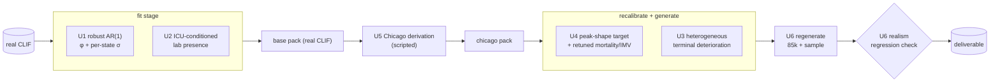

# feat: Close the synthetic-data realism gaps

## Summary

The network-median generator produces datasets whose **marginals** and **aggregate
rates** match real CLIF ICU data, but four realism gaps remain (surfaced in the
post-PR#2 audit). This plan closes all four, at their root, by re-fitting the base
parameter pack and reshaping generation — not by patching constants:

1. **Vitals temporal texture** — a single patient's vital series is white noise
   around the state mean (`phi=0`, one dispersion per vital across all acuity
   states). Real vitals are autocorrelated and heteroscedastic.
2. **Lab presence undershoot** — fitted `lab_presence` is computed over the whole
   fit cohort, so ICU-only generation undershoots (creatinine 0.73 vs real-ICU
   0.99).
3. **Terminal deterioration is one stereotyped ramp** — every decedent gets the
   same L3→L5 escalation; real deaths are heterogeneous.
4. **Peak-acuity shape** — recalibration piles peak mass at level 2 to hit the
   network-median IMV *rate*, so the acuity-mix *shape* matches no real profile.

Confirmed scope decisions: **re-fit the packs** (not post-hoc patching) and
**include peak-shape realignment** (accepting IMV/mortality re-tuning).

---

## Problem Frame

The generator's realism is validated on distributional fidelity (SDMetrics ~0.91)
and aggregate life-support/LOS/mortality rates, all of which pass. But three of the
four gaps are **conditional or temporal** properties that marginal fidelity does not
measure, and the fourth is a distribution-*shape* mismatch masked by a matching
*rate*:

- The vitals AR(1) model *supports* autocorrelation (the sampler reads `phi`), but
  the fit currently emits `phi≈0` and outlier-corrupted `sigma`. A prior fix added a
  robust trim to `_fit_ar1` and a `repair_vitals_dispersion` patch in the recalibrate
  layer, but the estimator fix was **never exercised on a real re-fit** — the delivered
  data used the patch. So the true φ/σ behavior on real data is unverified.
- `fit_lab_copula` computes `presence[lab] = n_hosp_with / n_hospitalizations` over the
  training cohort with no ICU conditioning, so presence reflects the cohort mix, not
  the ICU-only generation target.
- `spine._apply_terminal_deterioration` applies a single deterministic escalation ramp
  to every expiring stay.
- `recalibrate._temper_start` / `_temper_transitions` route acuity mass to level 2 to
  lower the IMV *fraction*; the resulting peak-level *distribution* is L2-heavy and
  does not track the real per-hospitalization peak distribution the fit already records
  (via `n_hospitalizations` in `expired_rate_by_peak_level`).

**In scope:** re-fit the base pack with autocorrelated, heteroscedastic vitals and
ICU-conditioned lab presence; heterogeneous terminal deterioration; peak-shape
realignment with target re-tuning; a reproducible Chicago-population derivation;
regeneration of the deliverable; and an end-to-end realism regression check.

**Out of scope:** new CLIF tables, changes to the conformance gate or mCIDE
vocabularies, the compliance/release flow, and PR #1 reconciliation (tracked
separately).

---

## Requirements

- **R1** — A single synthetic patient's vital-sign series is temporally
  autocorrelated (smooth, not white noise) and its dispersion varies by acuity
  state, learned from a real re-fit rather than hardcoded constants.
- **R2** — Per-lab presence in generated ICU encounters matches real-ICU presence
  (e.g. creatinine ~0.99, lactate ~0.69), because presence is fit conditioned on the
  ICU/acuity population the generator targets.
- **R3** — Terminal (dying) trajectories are heterogeneous across encounters —
  varying decline duration, escalation ceiling, and organ-failure pattern — rather
  than a single stereotyped ramp, while the *aggregate* decedent-vs-survivor
  separation is preserved.
- **R4** — The generated peak-acuity distribution tracks a realistic profile, while
  IMV and mortality rates are held within the network-median envelope (re-tuned as
  needed).
- **R5** — The Chicago-population derivation (demographic re-weighting, age shift,
  med-category normalization, enrichment flags) is reproducible from code, so a
  re-fit can be re-layered without interactive steps.
- **R6** — The full deliverable and sample are regenerated from the re-fit pack, and
  all prior guarantees still hold: 100% CLIF 2.1 mCIDE conformance, privacy
  (no memorization / statistical distinctness), and the aggregate rate/LOS/fidelity
  targets.
- **R7** — The end-to-end realism targets are captured as an automated check so a
  future change cannot silently regress them.

---

## Key Technical Decisions

- **KTD1 — Re-fit, don't patch.** Vitals autocorrelation and per-state dispersion are
  learned by re-running the fit stage on real CLIF with the robust estimator,
  producing a genuinely fitted base pack. Rationale: the empirical-fidelity principle
  (R15 in the source generator plan) — fitted structure over invented constants; the
  current `repair_vitals_dispersion` hardcodes aggregate σ and cannot supply real φ.
- **KTD2 — Retire the dispersion patch after re-fit.** Once the re-fit produces sane
  per-state σ, `repair_vitals_dispersion` becomes a fallback for legacy packs only
  (kept, documented, default-off for re-fit packs), not part of the canonical path.
- **KTD3 — ICU-condition lab presence at the fit.** `fit_lab_copula` takes the
  ICU-exposed cohort (or conditions presence on acuity ≥ ICU threshold) so presence
  matches the generation target, rather than correcting downstream.
- **KTD4 — Terminal heterogeneity via archetype sampling.** Deterioration draws one of
  a small set of documented clinical archetypes (e.g. abrupt collapse, prolonged
  multi-organ decline, withdrawal/comfort-care) with per-archetype window, ceiling,
  and organ-failure pattern — parameterized and gated, so aggregate separation is
  preserved while individual trajectories vary.
- **KTD5 — Peak-shape as an explicit target.** Recalibration gains a peak-distribution
  target (the real per-hospitalization peak profile the fit already stores), and the
  mortality/IMV re-tuning is re-solved against it rather than against the incidental
  L2-heavy shape.
- **KTD6 — φ estimation is an execution-time investigation.** Whether φ can be fit
  reliably on the coarse grid (sparse adjacent pairs) or needs native-cadence pairing
  is resolved during U1 with real data, with a documented fallback.

---

## High-Level Technical Design

The change spans both stages; the data path and where each unit acts:

Diagram is authoritative for *where* each unit acts; per-unit sections below are
authoritative for *what* changes.

---

## Implementation Units

### U1. Robust AR(1) re-fit — autocorrelation + heteroscedastic dispersion

**Goal:** Vitals are fit with meaningful per-state autocorrelation (`phi`) and
outlier-robust per-state dispersion (`sigma`), verified on a real re-fit — so
generated single-patient series are smooth and state-dependent in variance.

**Requirements:** R1. **Dependencies:** none.

**Files:** `src/clifforge/fit/estimators.py`, `src/clifforge/fit/run_fit.py`
(only if φ needs native-cadence pairing), `tests/fit/test_estimators.py`.

**Approach:** The robust MAD-trim already added to `_fit_ar1` is now exercised on a
real re-fit. Investigate why `phi≈0` on the current packs: the OLS pairs are lag-1
across *adjacent grid intervals*, and irregular vital cadence may leave too few
adjacent pairs per state. Options, resolved with real data: (a) confirm the robust
trim alone recovers a physiologic φ; (b) if adjacency is too sparse, pair on native
inter-observation spacing before gridding; (c) if φ is genuinely weak for a vital,
record a documented per-vital floor rather than 0. Per-state `sigma` is already
heteroscedastic by construction — the re-fit with robust residual σ restores that;
no sampler change is needed (`spine.sample_vitals` already reads `phi`/`sigma`).

**Execution note:** Investigate φ on real data before committing an approach; start
by re-fitting one vital and inspecting φ/σ per state against physiologic expectation.

**Test scenarios:**
- `_fit_ar1` on a clean autocorrelated synthetic series recovers φ close to the true
  value and σ close to the true residual SD (happy path).
- `_fit_ar1` with injected extreme outliers returns σ within a physiologic band (the
  trim holds) and φ not destroyed by the outliers (regression for the 4229-σ bug).
- `_fit_ar1` with fewer than 2 usable pairs after trimming falls back without raising.
- Per-state σ differs across states for a heteroscedastic input (not collapsed to one
  value).

**Verification:** Re-fit the base pack; per-vital φ is non-zero and physiologic,
per-state σ is in-bounds and varies by state; a generated series visibly autocorrelates
(lag-1 autocorrelation > 0) versus the current white-noise output.

### U2. ICU-conditioned lab presence fit

**Goal:** Per-lab presence in generated ICU encounters matches real-ICU presence.

**Requirements:** R2. **Dependencies:** none.

**Files:** `src/clifforge/fit/estimators.py` (`fit_lab_copula`),
`src/clifforge/fit/run_fit.py` (cohort/denominator wiring), `tests/fit/test_estimators.py`.

**Approach:** `presence[lab] = n_hosp_with / n_hospitalizations` currently uses the
full-cohort denominator. Condition presence on the ICU-exposed population the
generator targets — either by passing the ICU-exposed hospitalization set as the
denominator, or by computing presence over hospitalizations that reach the ICU acuity
threshold in the state timeline. Keep marginals and correlation unchanged; only the
presence vector is re-derived. Confirm the sampler path (`labs.sample_labs`
present-set draw) consumes the new values unchanged.

**Test scenarios:**
- Presence is computed against the ICU-exposed denominator, not the full cohort
  (unit test on a constructed cohort where the two differ).
- A lab present in every ICU stay but few non-ICU stays fits to ~1.0 presence.
- Marginals/correlation outputs are unchanged by the presence-conditioning change.

**Verification:** After re-fit, generated creatinine presence ≈ 0.99 and lactate ≈
0.69 (within tolerance of real-ICU), while lab value fidelity is unchanged.

### U3. Heterogeneous terminal deterioration

**Goal:** Dying trajectories vary across encounters (duration, ceiling, organ pattern)
while preserving the aggregate decedent-vs-survivor separation.

**Requirements:** R3. **Dependencies:** none (generation-stage, independent of re-fit).

**Files:** `src/clifforge/generate/spine.py` (`_apply_terminal_deterioration`),
`tests/generate/test_recalibrate.py`.

**Approach:** Replace the single deterministic ramp with archetype sampling from
`rng`: a small documented set (e.g. abrupt collapse — short window, high ceiling;
prolonged multi-organ decline — long window, laddered escalation, multiple flags;
withdrawal/comfort-care — de-escalation of support with rising markers). Each archetype
parameterizes the terminal window length, the acuity ceiling, and which organ-failure
flags activate and when. Keep it gated on `terminal_deterioration_hours` (present) plus
an archetype-mix parameter, default-off → byte-identical for packs without it.

**Test scenarios:**
- Over many expiring stays, more than one distinct terminal archetype appears (not all
  identical tails).
- Aggregate: mean MAP/creatinine trajectory of decedents still diverges from survivors
  (separation preserved) — Covers the realism property behind R3.
- A comfort-care archetype de-escalates support in the terminal window (acuity does not
  monotonically rise for that archetype).
- Determinism: same seed reproduces the same archetype assignment.

**Verification:** Sampled decedents show varied terminal patterns; the averaged
decline still separates decedents from survivors as in the current output.

### U4. Peak-acuity shape realignment

**Goal:** The generated peak-acuity distribution tracks a realistic profile, with IMV
and mortality held in the network-median envelope.

**Requirements:** R4. **Dependencies:** no code dependency on U1/U2, but the re-tuning
is validated against the re-fit pack — sequence after U1/U2 land.

**Files:** `src/clifforge/generate/recalibrate.py`, `tests/generate/test_recalibrate.py`.

**Approach:** Add a peak-distribution target to recalibration: the real per-hospitalization
peak profile is recoverable from `expired_rate_by_peak_level[*].n_hospitalizations`. Adjust
the start distribution and escalation routing to move the sampled peak distribution toward
that target (rather than piling on level 2), then re-solve `mortality_scale` and the
flag/escalation levers so IMV and mortality stay within the network-median envelope. Expose
the peak target and its weight as documented params with defaults tuned against the re-fit
pack.

**Execution note:** This is a coupled re-tune — expect to iterate peak-shape vs IMV/mortality
on the spine-only fast path (sample_spine) before the full pipeline, as in the original
recalibration work.

**Test scenarios:**
- With the peak target active, the sampled peak-level distribution moves toward the real
  profile (KS/total-variation distance to the target decreases vs the L2-heavy baseline).
- IMV fraction and mortality remain within the network-median envelope after realignment.
- The transform still does not mutate the input pack (deep-copy invariant, as existing tests).
- Default params (no peak target) reproduce the prior behavior.

**Verification:** Peak-level distribution is closer to the real profile than the current
L2-heavy shape; IMV ≈ 0.41 and mortality ≈ 0.095 hold.

### U5. Reproducible Chicago-population derivation

**Goal:** The Chicago demographic layer is derived from a base pack by code, so a re-fit
can be re-layered without interactive steps.

**Requirements:** R5. **Dependencies:** U1, U2 (needs the re-fit base pack).

**Files:** `src/clifforge/generate/populations.py` (new) or an extension of
`recalibrate.py`; `tests/generate/test_populations.py` (new); a thin fit/derive entry
under `scripts/` or a CLI subcommand.

**Approach:** Capture the previously-interactive derivation as one function:
race/ethnicity re-weighting to the Chicago profile, age-quantile shift, med-category
string normalization + marginal, and the enrichment flags — applied to a base pack to
produce the `chicago` pack. Parameterize the demographic targets so the profile is
explicit and auditable. This makes the base→chicago→network-median chain fully scripted.

**Test scenarios:**
- Applying the derivation to a base pack yields the expected race/ethnicity marginals and
  shifted age quantiles.
- Med-category marginal normalization maps the known raw strings to canonical mCIDE-adjacent
  forms.
- The derivation does not mutate the input base pack.
- `Test expectation:` output pack still generates and passes the conformance gate at small n.

**Verification:** Running the derivation on the re-fit base pack reproduces a `chicago`-
equivalent pack with the documented demographic profile.

### U6. Re-fit, regenerate deliverable, and lock realism with a regression check

**Goal:** Regenerate the full deliverable + sample from the re-fit pack and prove every
prior guarantee still holds, captured as an automated realism check.

**Requirements:** R6, R7. **Dependencies:** U1, U2, U3, U4, U5.

**Files:** the generation script (session scratch → promote to `scripts/generate_full.py`),
`tests/eval/test_realism_targets.py` (new), `README.md` / dataset docs (refresh numbers).

**Approach:** Re-run fit → Chicago derivation → `recalibrate_to_network_median` → chunked
generation. Re-verify the full panel (LOS, mortality, IMV, vasopressor, CRRT, prone),
density/presence, vitals/labs fidelity, trajectory separation, 100% mCIDE conformance,
zero orphans, and the privacy/distinctness metrics. Promote the key aggregate targets into
a marked (eval-extra) regression test that generates a small cohort and asserts each target
within tolerance, so future changes can't silently regress realism. Refresh the dataset
README/data-dictionary numbers.

**Execution note:** Smoke-verify on a small cohort first; only run the full 85k regeneration
once the small-cohort panel is green.

**Test scenarios:**
- Small-cohort generation: LOS medians, mortality, IMV, vasopressor, CRRT within tolerance
  of the network-median targets (regression guard).
- Vitals lag-1 autocorrelation > 0 and per-state σ variation present (locks U1).
- Creatinine/lactate presence within tolerance of real-ICU (locks U2).
- Decedent-vs-survivor MAP/creatinine separation present (locks U3 aggregate property).
- All tables pass the conformance gate; zero orphan rows across chunks.

**Verification:** The regenerated 85k deliverable and 250-encounter sample pass conformance,
privacy, and every realism target; the regression test is green in CI (eval extra).

---

## Scope Boundaries

**In scope:** the four realism gaps at their root (re-fit vitals φ/σ, ICU-conditioned lab
presence, heterogeneous terminal deterioration, peak-shape realignment), the reproducible
Chicago derivation, deliverable regeneration, and a realism regression check.

### Deferred to Follow-Up Work

- **PR #1 reconciliation** — the open `feat/respiratory-adt-fidelity` PR also adds
  `recalibrate.py`; resolve the collision (close or fold) separately.
- **Branch/PR hygiene** — the current branch name understates scope; cosmetic.
- **Vitals cross-vital coupling** — this plan makes each vital autocorrelated but does not
  add cross-vital temporal coupling (e.g. HR↔BP co-movement); defer unless the regression
  check shows it matters.

### Out of scope

- New CLIF tables, conformance-gate or mCIDE changes, and the compliance/release flow.

---

## Risks & Dependencies

- **Re-fit changes the base pack** → the delivered dataset must be regenerated (U6) and the
  interactively-derived `chicago` pack is invalidated until U5 scripts it. Mitigation: U5
  before U6; keep the old pack until the new one is verified.
- **φ may not fit cleanly on the coarse grid** (KTD6). Mitigation: U1 investigates with a
  documented fallback (native-cadence pairing or per-vital floor); the sampler already
  supports whatever φ the fit emits.
- **Peak-shape vs rate coupling** (U4) — moving peak shape perturbs IMV/mortality.
  Mitigation: re-tune on the spine-only fast path before full generation; hold the envelope
  as the acceptance bound.
- **DUA/compliance** — regenerated datasets remain the source cohort-derived local artifacts under the
  existing release gate; no change to that flow.
- **Real data availability** — the re-fit needs staged real CLIF at `~/Data/clif`
  and the `eval` extra for fidelity/privacy checks.

---

## Open Questions

- **Q1 (execution-time, U1):** Does the robust trim alone recover physiologic φ on the coarse
  grid, or is native-cadence pairing needed? Resolve by inspecting a single-vital re-fit.
- **Q2 (U4):** Which real peak profile is the target — the source cohort's own per-hospitalization peak
  distribution, or a network-median blend? Default: the fitted per-hospitalization peak
  profile, documented as the reference.
- **Q3 (U6):** Regenerate at the same 85,248 ICU-encounter scale, or re-derive the count from
  the re-fit cohort? Default: keep 85,248 for continuity unless the re-fit materially changes
  the ICU-encounter count.

---

## Verification Contract

- Full test suite green (existing 328 + new fit/generate/realism tests); ruff + mypy clean.
- Re-fit base pack: per-vital φ non-zero/physiologic, per-state σ in-bounds and heteroscedastic;
  ICU-conditioned lab presence matches real-ICU within tolerance.
- Regenerated deliverable: LOS/mortality/IMV/vasopressor/CRRT/prone within the network-median
  envelope; peak-level distribution closer to the real profile; decedent-vs-survivor separation
  preserved with heterogeneous archetypes; vitals autocorrelated.
- 100% CLIF 2.1 mCIDE conformance (all rows), zero orphans, privacy/distinctness metrics still
  healthy (no memorization, statistically distinct).
- Realism regression test green in CI (eval extra).

## Definition of Done

All six units landed and verified; the base pack re-fit with autocorrelated/heteroscedastic
vitals and ICU-conditioned lab presence; recalibration realigns peak shape while holding the
rate envelope; terminal deterioration is heterogeneous with preserved aggregate separation;
the Chicago derivation is scripted; the 85k deliverable and sample are regenerated and pass
conformance, privacy, and all realism targets; and the realism regression check guards them in CI.
