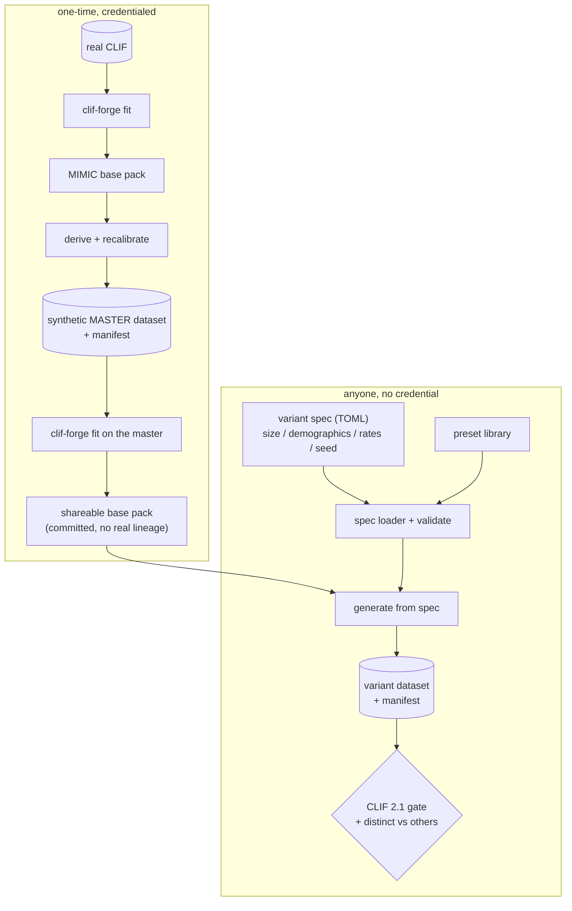

# feat: One master dataset + shareable derivative generation

## Summary

Turn the shipped synthetic ICU dataset into a **versioned master** that anyone can
build on, and give others a first-class way to **ideate and create their own
CLIF-like variants** — always distinct, always CLIF 2.1-conformant — without
needing credentialed real data. Two confirmed product decisions shape this:

1. **Ideation = declarative variant specs + a preset library.** A variant is a small
   TOML config file (size, demographics, illness rates, seed) that maps to the existing
   `derive_chicago_population` → `recalibrate_to_network_median` → generate chain.
   A library of example presets lets people copy-tweak-generate.
2. **A shareable synthetic base pack.** Publish a privacy-cleared, aggregate-only
   base pack — **fit on the synthetic master, not on real data** — so anyone can
   derive variants with no credential and no real-data lineage.

The knobs already exist (`scripts/generate_deliverable.py` flags; the deep-copy
recalibrate/derive API). This plan adds the *spec layer, the shareable base pack,
provenance/distinctness manifests, and the docs* that make it a usable feature.

---

## Problem Frame

The generator can already produce a base dataset and parameterized derivatives via
CLI flags, but three things are missing to make "one master + open derivation" real:

- **No shareable base to derive from.** Realistic generation needs a *fitted pack*,
  and the only one is fitted on credentialed MIMIC data (DUA-gated). Others have
  nothing to build on unless they stage their own real CLIF data.
- **No declarative variant surface.** Derivation is remembered CLI flags, not a
  saved, shareable, ideatable recipe. There is no preset library.
- **No provenance / distinctness record.** Nothing marks which dataset is the master,
  what config produced a variant, or proves two variants are genuinely different.

**In scope:** a variant-spec format + loader, a `--spec`/preset CLI surface, a
shareable synthetic base pack fit on the master, a generation manifest (config +
seed + version + checksums) with a distinctness guarantee, and docs. **Out of
scope:** new CLIF tables, changes to the fit/recalibration math (the knobs exist),
the compliance/release flow, and an agent/NL ideation UI (deferred).

---

## Requirements

- **R1** — A **master** dataset is a versioned, canonical artifact: it carries a
  generation manifest (spec, seed, generator version, per-table row counts/checksums)
  so it can be referenced and reproduced.
- **R2** — A **variant spec** is a single declarative file (TOML) that fully specifies
  a derivative — size, demographic targets, illness-rate targets, base pack, seed —
  and validates against a documented schema before generation.
- **R3** — A CLI surface generates a dataset from a spec (`clif-forge generate --spec
  <file>`) or a named preset, producing the dataset plus its manifest.
- **R4** — A **preset library** of example variant specs (e.g. high-acuity, older
  cohort, sepsis-heavy) ships in the repo; presets are discoverable and copyable.
- **R5** — A **shareable synthetic base pack** ships committable in the repo, fit on
  the synthetic master (no real-data lineage), so anyone can derive realistic variants
  with no credential.
- **R6** — Every generated variant records its spec + seed in its manifest and passes
  the CLIF 2.1 conformance gate; two different specs provably yield **distinct**
  datasets (different content), and identical spec+seed reproduces byte-for-byte.

---

## Key Technical Decisions

- **KTD1 — The shareable base pack is fit on the synthetic master, not on real data.**
  Generate the master → run `clif-forge fit` on it → commit the resulting pack. It is
  aggregate-only *and* has zero real-data lineage, so it is freely shareable and
  sidesteps the DUA entirely. Rationale: the master is already realistic (fidelity
  ~0.90), so a fit-on-synthetic round-trip preserves enough structure to seed
  realistic variants, while the recalibrated-MIMIC pack would still carry MIMIC
  provenance. (Alternative — ship the recalibrated MIMIC pack — is rejected: it needs
  a compliance nod and keeps real-data lineage.)
- **KTD2 — A variant spec is plain declarative config, not code.** TOML mapping to the
  documented derive/recalibrate parameters, read with the **stdlib `tomllib`** (Python
  3.11+, already the repo's interpreter) plus a small hand-written validator — **no new
  dependency**, honoring the repo's minimal permissive-only dep set (PyYAML is not a
  dependency and is not added). Unknown keys and out-of-range values are rejected with
  clear errors.
- **KTD3 — Presets are just specs.** A preset is a shipped variant-spec file; the
  preset "library" is a directory the CLI can list and load by name. No separate
  format — a preset and a user spec are the same thing, so copy-tweak works.
- **KTD4 — Distinctness is spec+seed provenance, not a similarity engine.** Each
  variant's manifest records the spec hash and seed; distinctness is guaranteed by the
  generator's determinism (different spec or seed → different SeedSequence → different
  content) and made auditable by the manifest, not by a post-hoc dataset-diff.
- **KTD5 — The manifest is a sidecar, not embedded in the parquet.** One
  `manifest.json` written next to the dataset (generator version, resolved config,
  seed, per-table row counts + content hash), so provenance travels with the data
  without touching the CLIF schema.

---

## High-Level Technical Design



The **authoring** lane (top) is run once by the maintainers to publish the master and
the shareable base pack. The **open** lane (bottom) is what any user runs: pick or
write a spec, generate against the shared base pack, get a conformant, distinct
variant with its own manifest. Prose sections below are authoritative for specifics.

---

## Output Structure

```
presets/                      # shipped example variant specs (R4)
  high-acuity.toml
  older-cohort.toml
  sepsis-heavy.toml
base_pack/                    # shareable synthetic base pack (R5), committed
  manifest.json
  tables/*.json
src/clifforge/
  variants.py                 # spec schema, loader, validate, map-to-params (U1)
scripts/
  build_base_pack.py          # master -> fit-on-synthetic -> shareable pack (U4)
```

---

## Implementation Units

### U1. Variant spec: schema, loader, and validation

**Goal:** A declarative variant spec (TOML) parses into a validated config that maps
to the derive/recalibrate/generate parameters.

**Requirements:** R2. **Dependencies:** none.

**Files:** `src/clifforge/variants.py`, `tests/generate/test_variants.py`.

**Approach:** Define a documented spec shape: `name`, `n`, `seed`, `base_pack`,
`demographics` (`age_shift`, `hispanic_frac`, optional `race_target`), `rates`
(`imv`, `mortality_scale`, `vaso_frac`, `crrt_prob`, `prone_severe`). Read TOML with
the stdlib `tomllib`, validate keys/ranges (reject unknown keys, raise on
out-of-range), and expose `load_spec(path) -> VariantSpec` plus
`spec_to_pack(spec, base_pack, real_dir=None)` that wires the existing
`derive_chicago_population` + `recalibrate_to_network_median` calls. Every field
defaults to the master's value, so a minimal spec reproduces the master.

**Patterns to follow:** the override params already on `derive_chicago_population` and
`recalibrate_to_network_median`; `scripts/generate_deliverable.py` `_build_pack`.

**Test scenarios:**
- A minimal spec (`name` only) validates and maps to the master's default params.
- A full spec sets each demographic/rate override and they reach the built pack
  (e.g. `rates.imv=0.55` → `peak_imv_target=0.55`).
- Unknown key → clear validation error; out-of-range rate (e.g. `mortality_scale=-1`)
  → validation error.
- `spec_to_pack` does not mutate the input base pack (deep-copy invariant).

**Verification:** `load_spec` + `spec_to_pack` produce a pack whose params reflect the
spec; invalid specs raise before generation.

### U2. CLI: generate from a spec or preset

**Goal:** `clif-forge generate --spec <file>` (and `--preset <name>`) generates a
dataset from a variant spec against a base pack.

**Requirements:** R3. **Dependencies:** U1, U3 (preset resolution).

**Files:** `src/clifforge/cli.py`, `tests/test_cli.py`.

**Approach:** Add `--spec` and `--preset` to the `generate` subcommand (mutually
exclusive with the ad-hoc rate flags; `--spec` wins). Resolve the spec → build the
pack via U1 → run chunked generation (reuse the `scripts/generate_deliverable.py`
path or call a shared helper) → write the dataset + manifest (U5). `--base-pack`
selects the pack (defaults to the shipped shareable base pack).

**Test scenarios:**
- `generate --preset high-acuity --n 200 --out …` writes a conformant dataset and a
  manifest.
- `--spec <file>` with a demographic override produces the expected shift (e.g.
  Hispanic fraction moves) at small n.
- `--spec` + a bad file path → clean nonzero exit with an actionable message.
- Missing base pack and no default → clear error.

**Verification:** a preset and a custom spec each generate a conformant dataset via the
CLI with a manifest.

### U3. Preset library

**Goal:** A shipped, discoverable set of example variant specs others copy and tweak.

**Requirements:** R4. **Dependencies:** U1.

**Files:** `presets/high-acuity.toml`, `presets/older-cohort.toml`,
`presets/sepsis-heavy.toml`, `src/clifforge/variants.py` (preset discovery),
`tests/generate/test_variants.py`.

**Approach:** Presets are variant specs under `presets/`. Add `list_presets()` and
`load_preset(name)` resolving from that directory. Each preset is a documented,
valid spec that changes one clinical axis meaningfully (acuity, age, sepsis/vaso).

**Test scenarios:**
- `list_presets()` returns the shipped preset names.
- Every shipped preset loads and validates (guards against a broken example).
- `load_preset("high-acuity")` yields a higher `rates.imv` than the master default.

**Verification:** all shipped presets validate; the CLI can list and load them.

### U4. Shareable synthetic base pack

**Goal:** A committable base pack fit on the synthetic master (no real-data lineage),
so anyone can derive realistic variants with no credential.

**Requirements:** R5. **Dependencies:** the master dataset must exist (authoring lane).

**Files:** `scripts/build_base_pack.py`, `base_pack/**` (committed), `.gitignore`
(exception for `base_pack/`), `tests/test_base_pack.py`.

**Approach:** Script the authoring step: run `run_fit` on the synthetic master dataset
directory to produce an aggregate pack, write it to `base_pack/`, and commit it (add a
gitignore exception like the `demo_output/` precedent). Record in its manifest that it
was fit on synthetic data (provenance = synthetic-master, not MIMIC). Verify a small
generation from it passes the conformance gate and lands in a plausible range.

**Execution note:** Verify the fit-on-synthetic round-trip preserves enough realism
(generate a small cohort from the shipped pack and sanity-check LOS/rates) before
committing the pack; if round-trip loss is large, record it and fall back to shipping
the recalibrated pack under the release gate (Open Questions Q1).

**Test scenarios:**
- The committed `base_pack/` loads as a valid `ParamPack` and carries every block the
  generators read.
- Generating a small cohort from `base_pack/` passes the conformance gate and is
  non-empty across tables.
- The pack manifest records synthetic-master provenance (no real dataset id).

**Verification:** `clif-forge generate --base-pack base_pack --preset … ` works with no
real data or credential.

### U5. Generation manifest + distinctness

**Goal:** Every generated dataset (master or variant) writes a manifest recording its
resolved config, seed, generator version, and per-table row counts + content hash;
distinctness between variants is auditable.

**Requirements:** R1, R6. **Dependencies:** U1.

**Files:** `src/clifforge/manifest.py`, `scripts/generate_deliverable.py` (write the
manifest), `src/clifforge/cli.py`, `tests/test_manifest.py`.

**Approach:** After a dataset is written, emit `manifest.json` beside it: generator
version, resolved spec (or `master`), seed, per-table `{rows, sha256-of-content}`. A
helper `datasets_are_distinct(manifest_a, manifest_b)` returns true when the content
hashes differ. Distinctness follows from determinism (different spec/seed → different
output); the manifest makes it checkable and marks the canonical master.

**Test scenarios:**
- Generating writes a `manifest.json` with the seed, resolved config, version, and a
  hash per table.
- Two datasets from different specs have different content hashes (distinct); same
  spec + seed reproduces identical hashes (reproducible).
- `datasets_are_distinct` returns false for a dataset compared to itself, true for two
  different specs.

**Verification:** every dataset carries a manifest; identical spec+seed → identical
hashes; different spec → different hashes.

### U6. Docs + conformance/distinctness regression

**Goal:** Document how to ideate and create CLIF-like variants, and lock the
"always distinct, always CLIF-like" guarantee with a regression test.

**Requirements:** R6. **Dependencies:** U1–U5.

**Files:** `README.md`, `tests/generate/test_variants_end_to_end.py`.

**Approach:** README section "Ideate your own CLIF-like dataset" covering the spec
format, the preset library, the shareable base pack (no credential needed), and the
manifest/reproducibility guarantees. Add an end-to-end test that generates two small
datasets from two different presets against the shipped base pack and asserts both
pass the conformance gate and are mutually distinct.

**Test scenarios:**
- Two different presets → two conformant datasets that are mutually distinct (content
  hashes differ). Covers R6.
- The master-equivalent spec reproduces the master's defaults (documented invariant).

**Verification:** the end-to-end test is green; the README recipe runs as written.

---

## Scope Boundaries

**In scope:** variant spec + loader, `--spec`/`--preset` CLI, preset library, shareable
synthetic base pack, generation manifest + distinctness, docs.

### Deferred to Follow-Up Work

- **Agent/natural-language ideation** — mapping a free-text variant description to a
  spec (the third ideation option); revisit once the declarative spec is in use.
- **A published dataset registry/index** across many variants (beyond per-dataset
  manifests).
- **Direct mortality-rate targeting** (currently a `mortality_scale` multiplier) —
  small usability follow-up.

### Out of scope

- New CLIF tables, fit/recalibration math changes, and the compliance/release flow.

---

## Risks & Dependencies

- **Fit-on-synthetic round-trip loss (U4)** — a pack fit on the synthetic master may
  lose some realism vs the MIMIC-fitted pack. Mitigation: verify a small generation
  before committing; fall back to the release-gated recalibrated pack if loss is large
  (Q1). This is the plan's one genuine execution-time unknown.
- **Base pack size committed to the repo** — parameter-pack JSON is small (hundreds of
  KB), so committing `base_pack/` is fine (mirrors the `demo_output/` exception).
- **Spec/flag precedence** — `--spec` and ad-hoc rate flags could conflict; the CLI
  makes `--spec` authoritative and documents it.
- **Dependency hygiene** — the spec format reads via the stdlib `tomllib`, adding no
  dependency; do not introduce a parser (e.g. PyYAML) that widens the dep set.

---

## Open Questions

- **Q1 (execution-time, U4):** Does the fit-on-synthetic base pack preserve enough
  realism to seed variants, or must we ship the recalibrated MIMIC pack under the
  release gate instead? Resolve by measuring a small generation from the fit-on-
  synthetic pack against the realism panel. Default: ship fit-on-synthetic.
- ~~Q2: YAML vs TOML for the spec format.~~ **Resolved: TOML** — read with the stdlib
  `tomllib`, so no new dependency (PyYAML is not in the dep set and would violate the
  minimal permissive-only policy).

---

## Verification Contract

- Full test suite green (existing + new variant/manifest/base-pack tests); ruff + mypy
  clean.
- `clif-forge generate --preset <name>` and `--spec <file>` produce conformant datasets
  with manifests, from the shipped base pack, with no real data or credential.
- Two different presets yield mutually distinct, CLIF 2.1-conformant datasets; identical
  spec+seed reproduces byte-identical output.
- The committed shareable base pack loads and generates conformant data; its manifest
  records synthetic-master (not real) provenance.

## Definition of Done

A user can copy a preset or write a small TOML spec, run one `clif-forge generate`
command against the shipped shareable base pack (no credential), and get a
CLIF 2.1-conformant dataset that is provably distinct from the master and from other
variants, each carrying a manifest that records exactly how it was made — while the
shipped network-median dataset is the versioned master everyone builds on.
